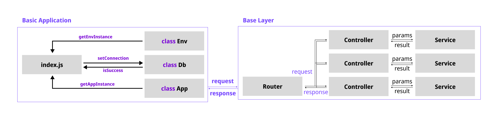

# 주특기 기본 주차 🎉 RESTful API 서버

- 서버 IPv4 : 52.78.9.253
- 해당 프로젝트는 [Boiler-Express/Base-Express](https://github.com/Boiler-Express/.github/blob/main/profile/BASIC-COURSE.md) 로 생성하였습니다.



<hr>

## 문서

- [문서 리스트](https://github.com/unchaptered/hanghae-backend-1/tree/main/docs)
  - [API 요구사항](https://github.com/unchaptered/hanghae-backend-1/blob/main/docs/api/API-REQUIREMENTS.md)
  - [API 명세서](https://github.com/unchaptered/hanghae-backend-1/blob/main/docs/api/API-STATEMENTS.md)
  - [아키텍쳐 설명](https://github.com/unchaptered/hanghae-backend-1/blob/main/docs/architecture/ARCHITECTURE.md)

<hr>

## 작업 현황

| Milestone                                           | Tag    | Relaese |
| :-------------------------------------------------- | :----- | :------ |
| [Prototype : 기본 서버 구현 + Unit Test(all)](https://github.com/unchaptered/hanghae-backend-1/milestone/1)                       | @1.0.0 | [Base Logic.](https://github.com/unchaptered/hanghae-backend-1/releases/tag/%401.0.0) |
| [Prototype : 기본 서버 배포](https://github.com/unchaptered/hanghae-backend-1/milestone/4) | @1.0.2 | [Base Deploy.](https://github.com/unchaptered/hanghae-backend-1/releases/tag/%401.0.2) |
| [Rafactor : 계층화되고 유지보수가 쉬운 서버로 개선](https://github.com/unchaptered/hanghae-backend-1/milestone/2)  | @1.2.1 | [Double Layer.](https://github.com/unchaptered/hanghae-backend-1/releases/tag/%401.2.1) |
| [Refactor : 모듈화를 통한 비즈니스 로직 간결화 + Unit Test(models, modules)](https://github.com/unchaptered/hanghae-backend-1/milestone/5) | @1.3.2 | [Double Layer, with Modules.](https://github.com/unchaptered/hanghae-backend-1/releases/tag/%401.3.2) |
| [CI/CD : EC2 배포 자동화 파이프 라인 구축](https://github.com/unchaptered/hanghae-backend-1/milestone/3)          | - | - |

<hr>

## 모듈 리스트

```json
  "dependencies": {
    "dotenv": "^16.0.1",
    "express": "^4.18.1",
    "mongoose": "^6.4.6"
  },
  "devDependencies": {
    "@babel/core": "^7.18.9",       // for testing, with es6.
    "@babel/preset-env": "^7.18.9", // for testing, with es6.
    "@types/jest": "^28.1.6",       // for testing, with es6.
    "jest": "^28.1.3",              // for testing, with es6.
    "supertest": "^6.2.4",          // for testing, with es6.
    "node-mocks-http": "^1.11.0",   // for testing, with es6.
    "cross-env": "^7.0.3",
    "nodemon": "^2.0.19"
  }
```
