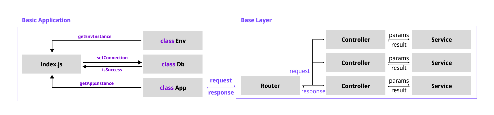

# Architecture

`과제로 만든 서버` 는 크게 2가지 부분으로 구성되어 있습니다.

1. `A 파트` - 직접적으로 Express 인스턴스에 관여하고 있는 부분
2. `B 파트` - Router 이후에 비즈니스 로직을 구성하고 있는 부분

해당 서버는 처음부터 큰 사이즈로 만들지 않았습니다.

개발의 각 단계에서 필요에 따라서 `함수 추출하기` 와 `레이어 나누기` 등의 작업을 진행하였고 지속적인 리팩토링을 통해서 서버를 개선하는 것을 목표로 하였습니다.

<hr>

## 파트별 설명



### A 파트 - 어플리케이션

어플리케이션 실행은 index.js 에서 실행되고 있습니다.

`index.js` 파일은 각각 다음의 순서를 거쳐서 서버를 실행 시킵니다.

1. 환경 변수 불러오기
2. 데이터베이스 연결하기
3. http 서버 가동하기

```javascript
(async () => {

    const { MODE, PORT, DB_ADDRESS } = Env.getEnvInstance();
    const result = await Db.setConnection(MODE, DB_ADDRESS);
    if (result.isSuccess) {

        console.log('데이터 베이스 연결에 성공했습니다.');
        const app = await App.getAppInstance(MODE, PORT);

    } else {

        console.log('데이터 베이스 연결에 실패했습니다.');
        console.log(result.message);

    }

})()
```

### B 파트 - 비즈니스 로직

비즈니스 로직은 `~/src/layers` 에서 진행되고 있습니다.

<hr>

### B.1. 레이어 분할

최초에 `단일 레이어` 로 운영되던 것에서 `이중 레이어` 로 변경하였습니다.

이를 통해서, 각 레이어의 책임을 명확하게 할 수 있었습니다.

<hr>

### B.2. 커스텀 예외 클래스

내장 예외 클래스인 `Error` 를 상속받아 `CustomException` 을 만들었습니다.

이 친구를 만든 이유는 다음과 같습니다.

- 커스텀 예외 클래스를 이용하여, if-else 구문을 최소화할 수 있다.
- 예외 클래스마다, 고유한 statusCode 를 고정해줘서 글로벌 핸들러를 사용할 수 있다.

<hr>

### B.3. 글로벌 예외 미들웨어 / 예외 핸들러

모든 요청의 마지막에는 `exceptionMiddleware` 가 자리잡고 있습니다.

클라이언트의 요청이 `실패` 하는 모든 경우 `next()` 와 `res.locals` 를 이용해서 효율적으로 정보를 반환 합니다.

특히, 모든 `CustomException` 은 고유한 `statusCode` 를 가지고 있어서 다음과 같이 처리할 수 있었습니다.

```javascript
// 글로벌 예외 미들웨어
export const exceptionMiddleware = (req, res, next) => {

    const formFactory = res.locals.formFactory;
    const error = res.locals.error;

    const except = exceptionHandler(error);

    return res.status(except.statusCode).json(
        formFactory.getFailureForm(except.message, {}));

}

// 예외 핸들러
export function exceptionHandler(err) {

    if (err instanceof CustomException) return err;
    else return new UnkownServerError(err.message);

}
```

<hr>

### B.4. 반환 객체 파이프 라인

반환 객체를 나타내는 클래스 `Form`, `SuccessForm`, `FailureForm` 가 있습니다.

또한 이를 생성하는 책임을 가진 `FormFactory` 가 하나의 모듈로써 작동하고 있습니다.

모든 경우의 수에, 일관된 반환 객체를 반환합니다.

```javascript
class Form {

    isSuccess; // boolean
    message; // string
    result; // object

}
```

<hr>

## Refereces

앞서 말했듯, 본 프로젝트는 탬플릿 프로젝트인 [Boiler-Express/Base-Express](https://github.com/Boiler-Express/Base-Express) 를 기반으로 만들어졌습니다.

> Architecture is layout of something. <br>
> `Server Architecture` is layout of Server, for... <br>
> - good for Maintenance
> - good to develope
>
> References(origin) [> Click](https://www.techopedia.com/definition/30262/server-architecture#:~:text=Server%20architecture%20is%20the%20foundational,the%20services%20that%20it%20provides.)